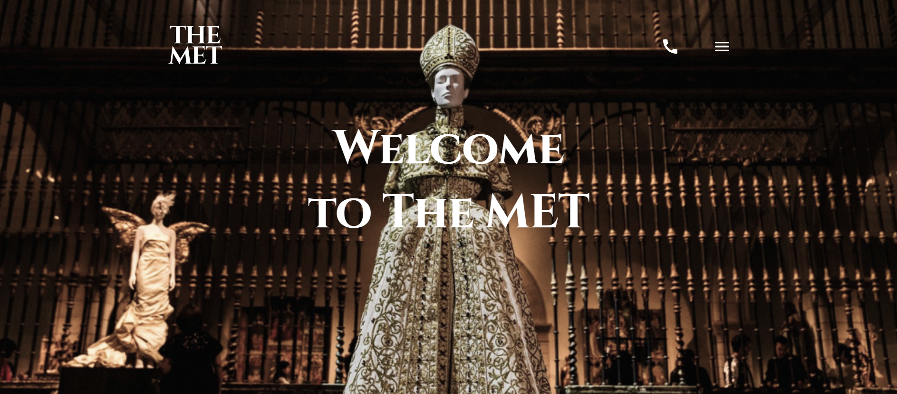
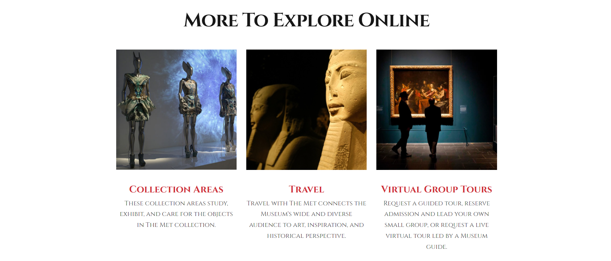
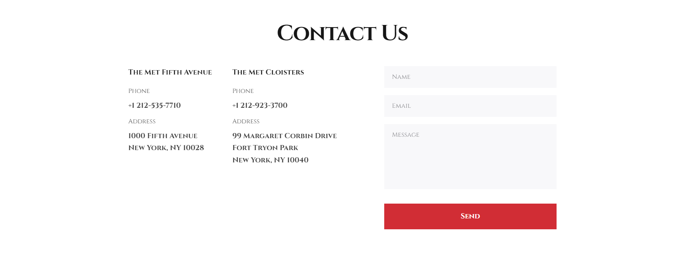

# Project Title: MET Landing Page

## Description
The MET Landing Page is a dynamic web project developed using HTML, SCSS, and JavaScript.

It offers a seamless and engaging user experience, featuring a well-designed menu for easy navigation, an interactive gallery showcasing the museum's extensive art collection, and a curated list of current exhibitions. The landing page also provides essential contact information, enabling visitors to connect with the museum effortlessly. Moreover, a user-friendly feedback form is integrated, encouraging active participation and valuable insights from users.

With its responsive design, the MET Museum Landing Page ensures optimal viewing across various devices, delivering an immersive and informative platform for art enthusiasts and visitors alike.

## Technologies Used
- HTML and SCSS: For styling and layout.
- JavaScript: For implementing interactivity and functionality.
- BEM (Block Element Modifier): For writing maintainable and scalable CSS code following the BEM methodology.

## Installation
1. Clone the repository:
`git clone https://github.com/IrynaBalandiukh/MET-landing-page.git`

2. Install dependencies:
`cd MET-landing-page`
`npm install`

3. Run the development server:
`npm start`

## Demo
Check out the live demo of the MET Landing Page [here](https://irynabalandiukh.github.io/MET-landing-page/).

## Screenshots

